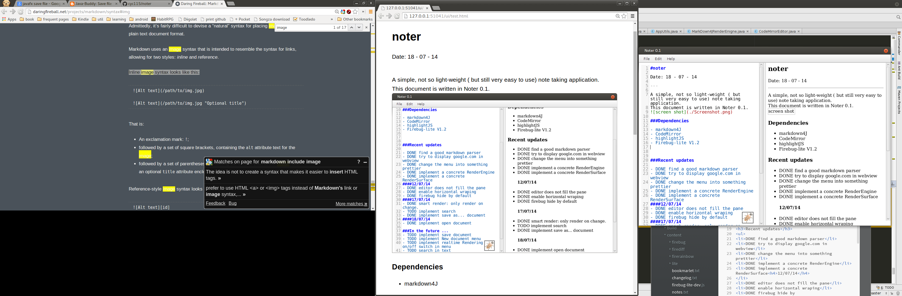

#noter

Date: 18 - 07 - 14 

---

A simple, not so light-weight ( but still very easy to use) note taking application.  
This document is written in Noter 0.1.


###Dependencies

- markdown4J 
- CodeMirror 
- highlightJS
- Firebug-lite V1.2

```java
//this is java code//
FileChooser fileChooser = new FileChooser();
fileChooser.setTitle("Open Resource File");
fileChooser.showOpenDialog(stage);
```
For the most part the markdown Parsing Engine is very good. however there is one little problem with two consecutive code blocks... 


```javascript
//just starting to learn js!
var f = function (){
	console.log("helloworld");
}
```

###Recent updates 

- DONE find a good markdown parser
- DONE try to display google.com in webview
- DONE change the menu into something prettier
- DONE implement a concrete RenderEngine
- DONE implement a concrete RenderSurface
####12/07/14
- DONE editor does not fill the pane
- DONE enable horizontal wraping
- DONE firebug hide by default
####17/07/14
- DONE smart render: only render on change.
- TODO implement search
- DONE implement save as... document
####18/07/14
- DONE implement open document

###In the future ...
- TODO implement save document
- TODO implement New document menu
- TODO implement realtime Rendering on/off switch in menu
- TODO search in text 
- TODO block select 

